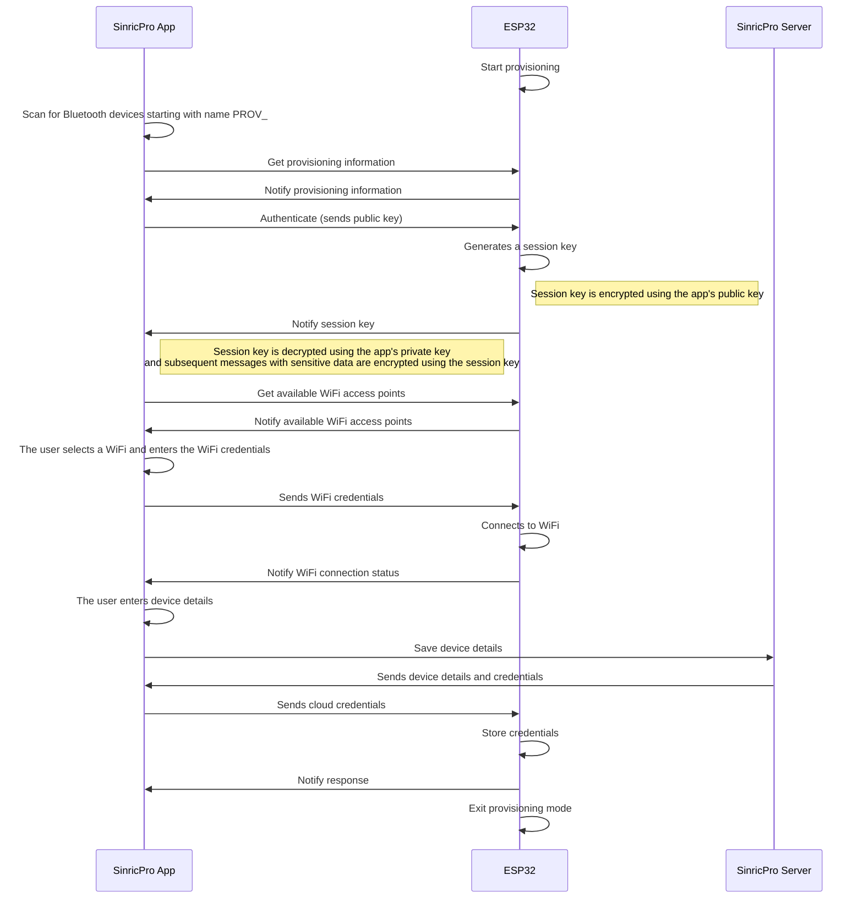

# SinricPro Business SDK

The SinricPro Business SDK empowers you to develop commercial products quickly. Prototype and launch in days, not weeks.

For more information, visit https://sinric.pro.

**This library supports only ESP32.**

## How to use this library

TODO: Move to a Separate page later when repo is public.

# Provisioning 

This document outlines the provisioning process between an ESP32 device and a mobile application.

### 1. Start provisioning.

The ESP32 starts in provisioning mode, advertising itself with a Bluetooth hostname prefixed with `PROV_`. This allows the mobile app to identify nearby devices ready for provisioning.

### 2. Scanning.

The mobile app scans for Bluetooth devices for 15 seconds, searching for names starting with PROV_. If multiple devices are found, the user will be prompted to select the desired one.

### 3. Connect to ESP32.

The app connects to the ESP32 and requests MTU size 512 (default is 23). 

### 4. App request provisioning information. 

1. The app writes to characteristic BLE_PROV_INFO_UUID `00000007-0000-1000-8000-00805f9b34fb` to get the product details.  

2. The ESP32 notifies the app with the below payload on characteristic BLE_INFO_NOTIFY_UUID `00000008-0000-1000-8000-00805f9b34fb`.

`{ "retailItemId": "xxxx", "version": "1" }`

`retailItemId` = The product ID from the business portal.
`version` = Is the provisioning protocol version. Right now it's set to 1.

3. The app loads the product details from the server and shows the product details to the user. The user clicks `Continue` in the app.

### 5. Authenticate.

1. The app generates an RSA key pair. 
2. The app writes the public key to characteristic BLE_KEY_EXCHANGE_UUID `00000002-0000-1000-8000-00805f9b34fb`.
3. The ESP32 loads the public key using `mbedtls_pk_parse_public_key` .
4. The ESP32 generates a random 32-byte session key using `mbedtls_ctr_drbg_random`. 
5. The ESP32 encrypts the session key using `mbedtls_pk_encrypt` and converts to base64.
6. The ESP32 notifies the encrypted session key on BLE characteristic BLE_KEY_EXCHANGE_NOTIFY_UUID `00000010-0000-1000-8000-00805f9b34fb`
7. The app decodes base64 and decrypts the session key using the private key (in step 1).

### 6. List WIFI.

1. The app requests for list of WiFi networks that ESP32 can connect to via characteristic BLE_WIFI_LIST_UUID `00000005-0000-1000-8000-00805f9b34fb`
2. The ESP32 scans for WiFi networks.
3. The ESP32 notifies list of WiFi networks via characteristic BLE_WIFI_LIST_NOTIFY_UUID `00000006-0000-1000-8000-00805f9b34fb`

### 7. WIFI Connect.

1. The user inputs WIFI credentials and clicks configure.
2. The app encrypts the WiFi credentials using the session key.
3. The app writes encrypted wifi credentials to BLE characteristic BLE_WIFI_CONFIG_UUID  `00000001-0000-1000-8000-00805f9b34fb`
4. The ESP32 connects to the WiFi network and notifies the following on BLE_WIFI_CONFIG_NOTIFY_UUID `00000004-0000-1000-8000-00805f9b34fb`

`{ "success": true }` or `{ "success": false, "message" : "connection failed!" }`

### 8. Enter product details and configure.

1. The user enters the product details.  name, description etc..
2. The user clicks save.
3. The app creates the devices on the server.
4. The app encrypts credentials/device IDs using the session key.
5. The app writes encrypted cloud configuration data to characteristic BLE_CLOUD_CREDENTIAL_CONFIG_UUID  `00000003-0000-1000-8000-00805f9b34fb`
6. The ESP32 decrypts the data using the session key.
7. The ESP32 saves the data.
8. The ESP32 notifies success on BLE_CLOUD_CREDENTIAL_CONFIG_NOTIFY_UUID `00000009-0000-1000-8000-00805f9b34fb`
9. The ESP32 exists in the provisioning mode.
10. The ESP32 connects to the SinricPro server.

##### Notes: 
1. Default NimBLE stack size is not large enough to cater to MBedLTS so the session key generation is running on a separate RTOS task.
2. Due to limitations in iPhone 8 max MTU size is 185. ESP32 writes in 180-byte chunks (the rest is for overhead) when applicable. ESP32 writes the size first then followed by data in chunks. The app resembles the data.
3. AES CTRX is used for encryption/decryption when applicable.
4. Two characteristics are used for communication. request/notify. This helps to mimic the async nature and write timeouts errors
