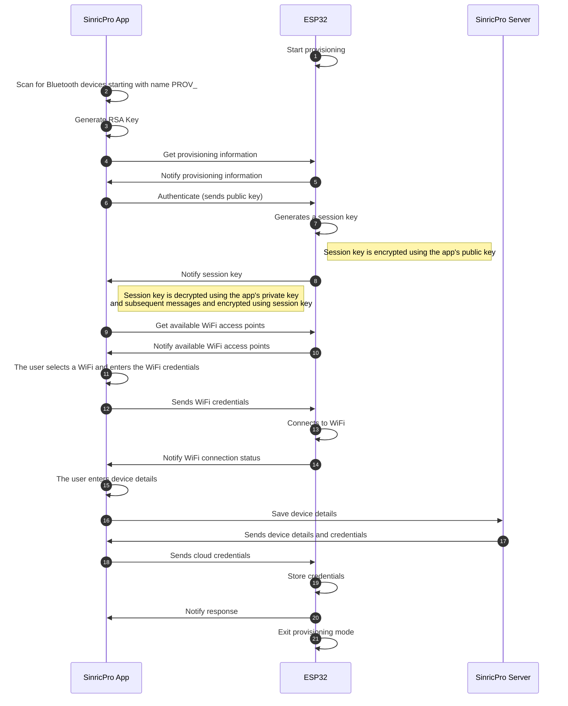

# Provisioning Workflow

```mermaid
sequenceDiagram
  autonumber
  participant srpa as SinricPro App
  participant esp32 as ESP32
  participant srps as SinricPro Server
  esp32->>esp32: Start provisioning   
  srpa->>srpa: Scan for Bluetooth devices starting with name PROV_
  srpa->>srpa: Generate RSA Key   
  srpa->>esp32: Get provisioning information
  esp32->>srpa: Notify provisioning information
  srpa->>esp32: Authenticate (sends public key)
  esp32->>esp32: Generates a session key
  Note right of esp32:  Session key is encrypted using the app's public key
  esp32->>srpa: Notify session key
  Note right of srpa: Session key is decrypted using the app's private key <br/> and subsequent messages and encrypted using session key
  srpa->>esp32: Get available WiFi access points
  esp32->>srpa: Notify available WiFi access points
  srpa->>srpa: The user selects a WiFi and enters the WiFi credentials
  srpa->>esp32: Sends WiFi credentials
  esp32->>esp32: Connects to WiFi
  esp32->>srpa: Notify WiFi connection status
  srpa->>srpa: The user enters device details
  srpa->>srps: Save device details
  srps->>srpa: Sends device details and credentials
  srpa->>esp32: Sends cloud credentials
  esp32->>esp32: Store credentials
  esp32->>srpa: Notify response
  esp32->>esp32: Exit provisioning mode

  %% https://mermaid.js.org/syntax/sequenceDiagram.html
```
