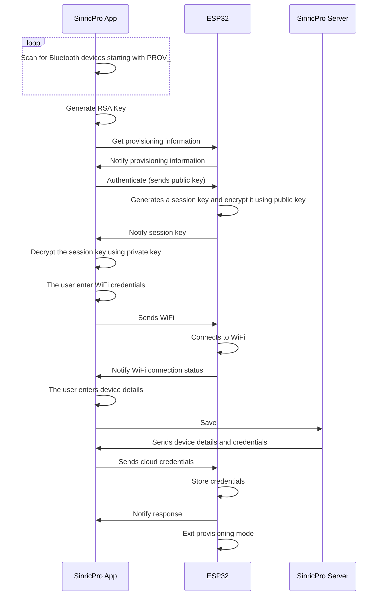

# Provisioning Workflow

```mermaid
sequenceDiagram
  participant srpa as SinricPro App
  participant esp32 as ESP32
  participant srps as SinricPro Server
  loop
    srpa->>srpa: Scan for Bluetooth devices starting with PROV_
  end 
  srpa->>srpa: Generate RSA Key   
  srpa->>esp32: Get provisioning information
  esp32->>srpa: Notify provisioning information
  srpa->>esp32: Authenticate (sends public key)
  esp32->>esp32: Generates a session key and encrypt it using public key
  esp32->>srpa: Notify session key
  srpa->>srpa: Decrypt the session key using private key
  srpa->>srpa: The user enter WiFi credentials
  srpa->>esp32: Sends WiFi
  esp32->>esp32: Connects to WiFi
  esp32->>srpa: Notify WiFi connection status
  srpa->>srpa: The user enters device details
  srpa->>srps: Save 
  srps->>srpa: Sends device details and credentials
  srpa->>esp32: Sends cloud credentials
  esp32->>esp32: Store credentials
  esp32->>srpa: Notify response
  esp32->>esp32: Exit provisioning mode
```
